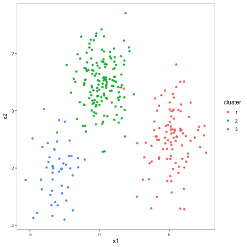
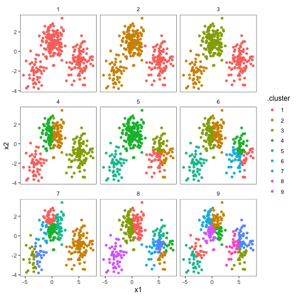
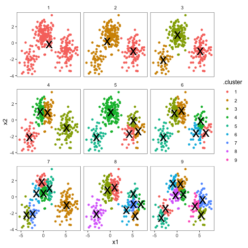
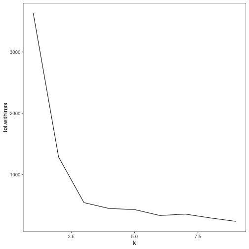

## Tidyverse


## What is the tidyverse? 

The tidyverse is a set of packages that work in harmony because they share common data representations and API design. They are designed to make it easier for data scientists to get their data "tidy", and they provide tools to assist with every step of an analysis:

Use                                   | Package
--------------------------------------|------------------------
Data visualization                    | `ggplot2`
Data manipulation                     | `dplyr`
Data tidying                          | `tidyr`
Data import                           | `readr`
Functional programming                | `purrr`
Better data frames                    | `tibble`


Many other packages are included as well: date/times, strings, databases, web APIs/scraping, Excel, ...

## `tibble`


## `tibble`s

A tibble is just a data frame with some improvements:

1. Printing
2. Subsetting

## Printing a `tibble`


```r
df <- tibble(
  x = runif(5),
  y = letters[1:5]
)
df
```

```
## # A tibble: 5 x 2
##       x y    
##   <dbl> <chr>
## 1 0.925 a    
## 2 0.301 b    
## 3 0.613 c    
## 4 0.563 d    
## 5 0.899 e
```

```r
(df2 <- as.data.frame(df))
```

```
##           x y
## 1 0.9245595 a
## 2 0.3006973 b
## 3 0.6126038 c
## 4 0.5632103 d
## 5 0.8988740 e
```

## Subsetting a `tibble`

Base R is inconsistent - sometimes `[` returns a data frame, sometimes a vector


```r
class(df2[ ,1:2]) 
```

```
## [1] "data.frame"
```

```r
class(df2[ ,1])   
```

```
## [1] "numeric"
```

Subsetting a `tibble` with `[` always returns another `tibble`.


```r
class(df[ ,1:2]) 
```

```
## [1] "tbl_df"     "tbl"        "data.frame"
```

```r
class(df[ ,1])
```

```
## [1] "tbl_df"     "tbl"        "data.frame"
```

## Subsetting a `tibble`

To get a vector from a `tibble`, use `$` or `[[`.


```r
df[ ,'y']
```

```
## # A tibble: 5 x 1
##   y    
##   <chr>
## 1 a    
## 2 b    
## 3 c    
## 4 d    
## 5 e
```

```r
df$y
```

```
## [1] "a" "b" "c" "d" "e"
```

```r
df[['y']]
```

```
## [1] "a" "b" "c" "d" "e"
```

## Warnings with `tibble`

Produces useful warnings if a column doesn't exist.


```r
df$z
```

```
## Warning: Unknown or uninitialised column: 'z'.
```

```
## NULL
```

```r
df2$z
```

```
## NULL
```


## `readr`


## Data import with `readr`

Consistent import functions: `read_csv()`, `read_tsv()`, `read_fwf()`, etc.


```r
read_csv('a, b, c
1, 2, 3
4, 5, 6')
```

```
## # A tibble: 2 x 3
##       a     b     c
##   <int> <int> <int>
## 1     1     2     3
## 2     4     5     6
```

* Typically about 10x faster than base R equivalents
* They produce tibbles, don't convert characters to factors, don't screw up column names
* More reproducible


## Importing a file with `readr`

`readr` tries to automatically guess the type of each column based on the first 1000 rows.


```r
challenge <- read_csv(readr_example('challenge.csv'))
```

```
## Parsed with column specification:
## cols(
##   x = col_integer(),
##   y = col_character()
## )
```

```
## Warning in rbind(names(probs), probs_f): number of columns of result is not
## a multiple of vector length (arg 1)
```

```
## Warning: 1000 parsing failures.
## row # A tibble: 5 x 5 col     row col   expected       actual       file                              expected   <int> <chr> <chr>          <chr>        <chr>                             actual 1  1001 x     no trailing c… .2383797508… '/Library/Frameworks/R.framework… file 2  1002 x     no trailing c… .4116799717… '/Library/Frameworks/R.framework… row 3  1003 x     no trailing c… .7460716762… '/Library/Frameworks/R.framework… col 4  1004 x     no trailing c… .7234505538… '/Library/Frameworks/R.framework… expected 5  1005 x     no trailing c… .6145241374… '/Library/Frameworks/R.framework…
## ... ................. ... ........................................................................... ........ ........................................................................... ...... ........................................................................... .... ........................................................................... ... ........................................................................... ... ........................................................................... ........ ...........................................................................
## See problems(...) for more details.
```

## Importing a file with `readr`

Any parsing problems are not just displayed as a warning, but actually available as a `tibble`.


```r
problems(challenge)
```

```
## # A tibble: 1,000 x 5
##      row col   expected       actual      file                             
##    <int> <chr> <chr>          <chr>       <chr>                            
##  1  1001 x     no trailing c… .238379750… '/Library/Frameworks/R.framework…
##  2  1002 x     no trailing c… .411679971… '/Library/Frameworks/R.framework…
##  3  1003 x     no trailing c… .746071676… '/Library/Frameworks/R.framework…
##  4  1004 x     no trailing c… .723450553… '/Library/Frameworks/R.framework…
##  5  1005 x     no trailing c… .614524137… '/Library/Frameworks/R.framework…
##  6  1006 x     no trailing c… .473980569… '/Library/Frameworks/R.framework…
##  7  1007 x     no trailing c… .578461039… '/Library/Frameworks/R.framework…
##  8  1008 x     no trailing c… .241593722… '/Library/Frameworks/R.framework…
##  9  1009 x     no trailing c… .114378662… '/Library/Frameworks/R.framework…
## 10  1010 x     no trailing c… .298344632… '/Library/Frameworks/R.framework…
## # … with 990 more rows
```

## Importing a file with `readr`


```r
challenge <- read_csv(
  readr_example("challenge.csv"), 
  col_types = cols(
    x = col_double(),
    y = col_character()
  )
)
tail(challenge)
```

```
## # A tibble: 6 x 2
##       x y         
##   <dbl> <chr>     
## 1 0.805 2019-11-21
## 2 0.164 2018-03-29
## 3 0.472 2014-08-04
## 4 0.718 2015-08-16
## 5 0.270 2020-02-04
## 6 0.608 2019-01-06
```

## Importing a file with `readr`


```r
challenge <- read_csv(
  readr_example("challenge.csv"), 
  col_types = cols(
    x = col_double(),
    y = col_date()
  )
)
tail(challenge)
```

```
## # A tibble: 6 x 2
##       x y         
##   <dbl> <date>    
## 1 0.805 2019-11-21
## 2 0.164 2018-03-29
## 3 0.472 2014-08-04
## 4 0.718 2015-08-16
## 5 0.270 2020-02-04
## 6 0.608 2019-01-06
```

It's a good idea to always explicitly specify column types!

## `readr` speed-test

A sample data file with 15,000 entries and 5 columns. 

`read_csv`

```r
init1 <- Sys.time(); df1 <- read_csv("test.csv"); final1 <- Sys.time()
final1-init1
```

```
## Time difference of 0.04323101 secs
```


`read.csv`

```r
init2 <- Sys.time(); df2 <- read.csv("test.csv"); final2 <- Sys.time()
final2-init2
```

```
## Time difference of 0.1239212 secs
```


## Writing out a file with `readr`

Writing data back to disk can be done with `write_csv()` or `write_tsv()`. These make it more likely the data can be read back in correctly.

* Strings are always encoded in UTF-8
* Dates and date-times are always stored in the same standard format (ISO8601)

Use `write_excel_csv()` if you plan to open a csv in Excel.

## Other types of data

Data type               | Package
------------------------|--------------------
SPSS, Stata, SAS        | `haven`
Excel (.xls or .xlsx)   | `readxl`
Relational database     | `DBI` + database-specific backend (`RMySQL`, `RSQLite`, ...)
JSON                    | `jsonlite`
XML                     | `XML2`


## `dplyr`


## `dplyr`

The `dplyr` package simplifies how you think about common data manipulation tasks. It provides simple "verbs", functions that correspond to these tasks, to help you take your thoughts about what you need to do and translate them into code.

Verb          | Use
--------------|------------------------------------------------
`filter`      | Filters out rows according to some conditions
`arrange`     | Reorders rows according to some conditions
`select`      | Selects a subset of columns
`mutate`      | Adds a new column as a function of existing columns
`summarize`   | Collapses a data frame to a single row
`group_by`    | Breaks a data frame into groups of rows

## The pipe operator

`dplyr` imports the `%>%` operator from the `magrittr` package. `x %>% f(y)` is equivalent to `f(x, y)`. This allows for the verbs to be chained together in a very readable way.

<div class="centered">

</div>

## Example of the pipe operator
Confidence intervals for the correlation from a regression model using Fisher z-transformation. 
$$tanh \left( tanh^{-1}(r) \pm 1.96 \frac{1}{\sqrt{n-3}}  \right)$$
Without `%>%`:


```r
n <- 100; rho <- 0.4
x <- rnorm(n); y <- rho*x + sqrt(1-(rho^2))*rnorm(n)

CI.r1 <- tanh( c(atanh(cor(x,y)) - 1.96/sqrt(n-3),  atanh(cor(x,y)) + 1.96/sqrt(n-3) ) )
CI.r1
```

```
## [1] 0.2404618 0.5671286
```

With `%>%`:


```r
CI.r2 <- cor(x,y) %>% atanh() %>%  rep(2) %>% +c(-1.96/sqrt(n-3),1.96/sqrt(n-3)) %>% tanh()
CI.r2
```

```
## [1] 0.2404618 0.5671286
```


## A `dplyr` example


```r
library(nycflights13)
flights
```

```
## # A tibble: 336,776 x 19
##     year month   day dep_time sched_dep_time dep_delay arr_time
##    <int> <int> <int>    <int>          <int>     <dbl>    <int>
##  1  2013     1     1      517            515         2      830
##  2  2013     1     1      533            529         4      850
##  3  2013     1     1      542            540         2      923
##  4  2013     1     1      544            545        -1     1004
##  5  2013     1     1      554            600        -6      812
##  6  2013     1     1      554            558        -4      740
##  7  2013     1     1      555            600        -5      913
##  8  2013     1     1      557            600        -3      709
##  9  2013     1     1      557            600        -3      838
## 10  2013     1     1      558            600        -2      753
## # … with 336,766 more rows, and 12 more variables: sched_arr_time <int>,
## #   arr_delay <dbl>, carrier <chr>, flight <int>, tailnum <chr>,
## #   origin <chr>, dest <chr>, air_time <dbl>, distance <dbl>, hour <dbl>,
## #   minute <dbl>, time_hour <dttm>
```


## A `dplyr` example

Suppose we want to find all the days on which both the average arrival delay and average departure delay were over 30 minutes.

Base R:


```r
flights_avgdelay <- aggregate(flights[c('arr_delay', 'dep_delay')],
                              flights[c('year', 'month', 'day')],
                              mean, na.rm = TRUE)
flights_avgdelay30 <- flights_avgdelay[flights_avgdelay$arr_delay > 30 &
                                         flights_avgdelay$dep_delay > 30, ]
final <- flights_avgdelay30[order(flights_avgdelay30$arr_delay,
                                               decreasing = TRUE), ]
```

`dplyr`:


```r
final <- flights %>% 
  group_by(year, month, day) %>%
  select(arr_delay, dep_delay) %>%
  summarize(arr = mean(arr_delay, na.rm = TRUE),
            dep = mean(dep_delay, na.rm = TRUE)) %>%
  filter(arr > 30, dep > 30) %>% 
  arrange(desc(arr))
```

## A `dplyr` example


```
## # A tibble: 36 x 5
## # Groups:   year, month [10]
##     year month   day   arr   dep
##    <int> <int> <int> <dbl> <dbl>
##  1  2013     3     8  85.9  83.5
##  2  2013     6    13  63.8  45.8
##  3  2013     7    22  62.8  46.7
##  4  2013     5    23  62.0  51.1
##  5  2013     7    10  59.6  52.9
##  6  2013     9    12  58.9  50.0
##  7  2013     7     1  58.3  56.2
##  8  2013    12    17  55.9  40.7
##  9  2013     8     8  55.5  43.3
## 10  2013    12     5  51.7  52.3
## # … with 26 more rows
```


## `tidyr`


## Different ways to represent your data

Each of these datasets shows the same information: **country**, **year**, **population**, and **cases**.


```r
table1
```

```
## # A tibble: 6 x 4
##   country      year  cases population
##   <chr>       <int>  <int>      <int>
## 1 Afghanistan  1999    745   19987071
## 2 Afghanistan  2000   2666   20595360
## 3 Brazil       1999  37737  172006362
## 4 Brazil       2000  80488  174504898
## 5 China        1999 212258 1272915272
## 6 China        2000 213766 1280428583
```

----


```r
table2
```

```
## # A tibble: 12 x 4
##    country      year type            count
##    <chr>       <int> <chr>           <int>
##  1 Afghanistan  1999 cases             745
##  2 Afghanistan  1999 population   19987071
##  3 Afghanistan  2000 cases            2666
##  4 Afghanistan  2000 population   20595360
##  5 Brazil       1999 cases           37737
##  6 Brazil       1999 population  172006362
##  7 Brazil       2000 cases           80488
##  8 Brazil       2000 population  174504898
##  9 China        1999 cases          212258
## 10 China        1999 population 1272915272
## 11 China        2000 cases          213766
## 12 China        2000 population 1280428583
```

----


```r
table3
```

```
## # A tibble: 6 x 3
##   country      year rate             
## * <chr>       <int> <chr>            
## 1 Afghanistan  1999 745/19987071     
## 2 Afghanistan  2000 2666/20595360    
## 3 Brazil       1999 37737/172006362  
## 4 Brazil       2000 80488/174504898  
## 5 China        1999 212258/1272915272
## 6 China        2000 213766/1280428583
```

----


```r
table4a
```

```
## # A tibble: 3 x 3
##   country     `1999` `2000`
## * <chr>        <int>  <int>
## 1 Afghanistan    745   2666
## 2 Brazil       37737  80488
## 3 China       212258 213766
```

```r
table4b
```

```
## # A tibble: 3 x 3
##   country         `1999`     `2000`
## * <chr>            <int>      <int>
## 1 Afghanistan   19987071   20595360
## 2 Brazil       172006362  174504898
## 3 China       1272915272 1280428583
```

## What makes a dataset tidy?

1. Each variable must have its own column.
2. Each observation must have its own row.
3. Each value must have its own cell.

Practical instructions:

1. Put each dataset in a tibble.
2. Put each variable in a column.

Which one of those previous tables is tidy?

## Why use tidy data?

Two main advantages:

1. Good to pick one consistent way of storing data.
2. Ensuring each variable has a column lets you take full advantage of R's vectorization.

All of the tidyverse packages are designed to work with tidy data.


```r
table1 %>% 
  mutate(rate = cases / population * 10000)
```

```
## # A tibble: 6 x 5
##   country      year  cases population  rate
##   <chr>       <int>  <int>      <int> <dbl>
## 1 Afghanistan  1999    745   19987071 0.373
## 2 Afghanistan  2000   2666   20595360 1.29 
## 3 Brazil       1999  37737  172006362 2.19 
## 4 Brazil       2000  80488  174504898 4.61 
## 5 China        1999 212258 1272915272 1.67 
## 6 China        2000 213766 1280428583 1.67
```

## Fixing untidy data with `tidyr`

Data is often organized to make entry as easy as possible (e.g. in Excel). Often there will be one of two problems:

1. One variable is spread across multiple columns.
2. One observation is scattered across multiple rows.

To fix these, we can use `spread()` and `gather()` from the `tidyr` package.

## Gathering


```r
table4a
```

```
## # A tibble: 3 x 3
##   country     `1999` `2000`
## * <chr>        <int>  <int>
## 1 Afghanistan    745   2666
## 2 Brazil       37737  80488
## 3 China       212258 213766
```

The `1999` and `2000` columns are values, not variables! The correct variable would be "year". To gather those columns, we need to specify:

* The set of columns that represent values: `1999` and `2000`
* The name of the variable whose values are the column names: `year`
* The name of the variable whose values are in the cells: `cases`

## Gathering


```r
table4a %>% 
  gather(`1999`, `2000`, key = 'year', value = 'cases')
```

```
## # A tibble: 6 x 3
##   country     year   cases
##   <chr>       <chr>  <int>
## 1 Afghanistan 1999     745
## 2 Brazil      1999   37737
## 3 China       1999  212258
## 4 Afghanistan 2000    2666
## 5 Brazil      2000   80488
## 6 China       2000  213766
```

## Spreading


```r
table2
```

```
## # A tibble: 12 x 4
##    country      year type            count
##    <chr>       <int> <chr>           <int>
##  1 Afghanistan  1999 cases             745
##  2 Afghanistan  1999 population   19987071
##  3 Afghanistan  2000 cases            2666
##  4 Afghanistan  2000 population   20595360
##  5 Brazil       1999 cases           37737
##  6 Brazil       1999 population  172006362
##  7 Brazil       2000 cases           80488
##  8 Brazil       2000 population  174504898
##  9 China        1999 cases          212258
## 10 China        1999 population 1272915272
## 11 China        2000 cases          213766
## 12 China        2000 population 1280428583
```

Here one observation is scattered over two rows. The `type` column actually contains two variables, `cases` and `population`. To tidy this, we need to specify:

* The column that contains variable names: `type`
* The column that contains values from multiple variables: `count`

## Spreading


```r
table2 %>% 
  spread(key = type, value = count)
```

```
## # A tibble: 6 x 4
##   country      year  cases population
##   <chr>       <int>  <int>      <int>
## 1 Afghanistan  1999    745   19987071
## 2 Afghanistan  2000   2666   20595360
## 3 Brazil       1999  37737  172006362
## 4 Brazil       2000  80488  174504898
## 5 China        1999 212258 1272915272
## 6 China        2000 213766 1280428583
```

## Separating

How do we fix this?


```r
table3
```

```
## # A tibble: 6 x 3
##   country      year rate             
## * <chr>       <int> <chr>            
## 1 Afghanistan  1999 745/19987071     
## 2 Afghanistan  2000 2666/20595360    
## 3 Brazil       1999 37737/172006362  
## 4 Brazil       2000 80488/174504898  
## 5 China        1999 212258/1272915272
## 6 China        2000 213766/1280428583
```

The `rate` column contains two variables: `cases` and `population`. We can separate it into two columns with the `separate()` function.

## Separating


```r
table3 %>% 
  separate(rate, into = c('cases', 'population'), sep = '/', convert = TRUE)
```

```
## # A tibble: 6 x 4
##   country      year  cases population
##   <chr>       <int>  <int>      <int>
## 1 Afghanistan  1999    745   19987071
## 2 Afghanistan  2000   2666   20595360
## 3 Brazil       1999  37737  172006362
## 4 Brazil       2000  80488  174504898
## 5 China        1999 212258 1272915272
## 6 China        2000 213766 1280428583
```

By default, `separate()` will split on any non-alphanumeric character. The `convert` argument will try to convert the resulting columns into a better type.

You can do the inverse operation with `unite()`, but it isn't all that useful.

## A tidying challenge


```r
tidyr::who
```

```
## # A tibble: 7,240 x 60
##    country iso2  iso3   year new_sp_m014 new_sp_m1524 new_sp_m2534
##    <chr>   <chr> <chr> <int>       <int>        <int>        <int>
##  1 Afghan… AF    AFG    1980          NA           NA           NA
##  2 Afghan… AF    AFG    1981          NA           NA           NA
##  3 Afghan… AF    AFG    1982          NA           NA           NA
##  4 Afghan… AF    AFG    1983          NA           NA           NA
##  5 Afghan… AF    AFG    1984          NA           NA           NA
##  6 Afghan… AF    AFG    1985          NA           NA           NA
##  7 Afghan… AF    AFG    1986          NA           NA           NA
##  8 Afghan… AF    AFG    1987          NA           NA           NA
##  9 Afghan… AF    AFG    1988          NA           NA           NA
## 10 Afghan… AF    AFG    1989          NA           NA           NA
## # … with 7,230 more rows, and 53 more variables: new_sp_m3544 <int>,
## #   new_sp_m4554 <int>, new_sp_m5564 <int>, new_sp_m65 <int>,
## #   new_sp_f014 <int>, new_sp_f1524 <int>, new_sp_f2534 <int>,
## #   new_sp_f3544 <int>, new_sp_f4554 <int>, new_sp_f5564 <int>,
## #   new_sp_f65 <int>, new_sn_m014 <int>, new_sn_m1524 <int>,
## #   new_sn_m2534 <int>, new_sn_m3544 <int>, new_sn_m4554 <int>,
## #   new_sn_m5564 <int>, new_sn_m65 <int>, new_sn_f014 <int>,
## #   new_sn_f1524 <int>, new_sn_f2534 <int>, new_sn_f3544 <int>,
## #   new_sn_f4554 <int>, new_sn_f5564 <int>, new_sn_f65 <int>,
## #   new_ep_m014 <int>, new_ep_m1524 <int>, new_ep_m2534 <int>,
## #   new_ep_m3544 <int>, new_ep_m4554 <int>, new_ep_m5564 <int>,
## #   new_ep_m65 <int>, new_ep_f014 <int>, new_ep_f1524 <int>,
## #   new_ep_f2534 <int>, new_ep_f3544 <int>, new_ep_f4554 <int>,
## #   new_ep_f5564 <int>, new_ep_f65 <int>, newrel_m014 <int>,
## #   newrel_m1524 <int>, newrel_m2534 <int>, newrel_m3544 <int>,
## #   newrel_m4554 <int>, newrel_m5564 <int>, newrel_m65 <int>,
## #   newrel_f014 <int>, newrel_f1524 <int>, newrel_f2534 <int>,
## #   newrel_f3544 <int>, newrel_f4554 <int>, newrel_f5564 <int>,
## #   newrel_f65 <int>
```

# Tidy modeling

## The `broom` package

> "While model inputs usually require tidy inputs, such attention to detail doesn't carry over to model outputs. Outputs such as predictions and estimated coefficients aren't always tidy. This makes it more difficult to combine results from multiple models."


```r
fit <- lm(mpg ~ wt, data = mtcars)
fit
```

```
## 
## Call:
## lm(formula = mpg ~ wt, data = mtcars)
## 
## Coefficients:
## (Intercept)           wt  
##      37.285       -5.344
```

----


```r
summary(fit)
```

```
## 
## Call:
## lm(formula = mpg ~ wt, data = mtcars)
## 
## Residuals:
##     Min      1Q  Median      3Q     Max 
## -4.5432 -2.3647 -0.1252  1.4096  6.8727 
## 
## Coefficients:
##             Estimate Std. Error t value Pr(>|t|)    
## (Intercept)  37.2851     1.8776  19.858  < 2e-16 ***
## wt           -5.3445     0.5591  -9.559 1.29e-10 ***
## ---
## Signif. codes:  0 '***' 0.001 '**' 0.01 '*' 0.05 '.' 0.1 ' ' 1
## 
## Residual standard error: 3.046 on 30 degrees of freedom
## Multiple R-squared:  0.7528,	Adjusted R-squared:  0.7446 
## F-statistic: 91.38 on 1 and 30 DF,  p-value: 1.294e-10
```

## The `broom` package

Most models produce output at three levels:

1. Model level: $R^2$, residual standard error, MSE
2. Term level: coefficient estimates, p-values, per-cluster information
3. Observation level: predictions, residuals, cluster assignments

`broom` provides functions to tidy model output in each of these three ways.

1. `glance()`: constructs a one-row summary of the model.
2. `tidy()`: summarizes the model's findings in a data frame.
3. `augment()`: adds columns to the original data.

This is extremely powerful when combined with `dplyr`.

----


```r
library(broom)
glance(fit) %>% as_tibble()
```

```
## # A tibble: 1 x 11
##   r.squared adj.r.squared sigma statistic  p.value    df logLik   AIC   BIC
##       <dbl>         <dbl> <dbl>     <dbl>    <dbl> <int>  <dbl> <dbl> <dbl>
## 1     0.753         0.745  3.05      91.4 1.29e-10     2  -80.0  166.  170.
## # … with 2 more variables: deviance <dbl>, df.residual <int>
```

```r
tidy(fit) %>% as_tibble()
```

```
## # A tibble: 2 x 5
##   term        estimate std.error statistic  p.value
##   <chr>          <dbl>     <dbl>     <dbl>    <dbl>
## 1 (Intercept)    37.3      1.88      19.9  8.24e-19
## 2 wt             -5.34     0.559     -9.56 1.29e-10
```

----


```r
augment(fit) %>% as_tibble()
```

```
## # A tibble: 32 x 10
##    .rownames   mpg    wt .fitted .se.fit .resid   .hat .sigma .cooksd
##    <chr>     <dbl> <dbl>   <dbl>   <dbl>  <dbl>  <dbl>  <dbl>   <dbl>
##  1 Mazda RX4  21    2.62    23.3   0.634 -2.28  0.0433   3.07 1.33e-2
##  2 Mazda RX…  21    2.88    21.9   0.571 -0.920 0.0352   3.09 1.72e-3
##  3 Datsun 7…  22.8  2.32    24.9   0.736 -2.09  0.0584   3.07 1.54e-2
##  4 Hornet 4…  21.4  3.22    20.1   0.538  1.30  0.0313   3.09 3.02e-3
##  5 Hornet S…  18.7  3.44    18.9   0.553 -0.200 0.0329   3.10 7.60e-5
##  6 Valiant    18.1  3.46    18.8   0.555 -0.693 0.0332   3.10 9.21e-4
##  7 Duster 3…  14.3  3.57    18.2   0.573 -3.91  0.0354   3.01 3.13e-2
##  8 Merc 240D  24.4  3.19    20.2   0.539  4.16  0.0313   3.00 3.11e-2
##  9 Merc 230   22.8  3.15    20.5   0.540  2.35  0.0314   3.07 9.96e-3
## 10 Merc 280   19.2  3.44    18.9   0.553  0.300 0.0329   3.10 1.71e-4
## # … with 22 more rows, and 1 more variable: .std.resid <dbl>
```

## Tibbles can store lists too!

What if we wanted to fit a separate linear model to different groups of data?


```r
regressions <- mtcars %>% 
  group_by(cyl) %>% 
  do(fit = lm(mpg ~ wt + qsec + gear, data = .))
regressions
```

```
## Source: local data frame [3 x 2]
## Groups: <by row>
## 
## # A tibble: 3 x 2
##     cyl fit     
## * <dbl> <list>  
## 1     4 <S3: lm>
## 2     6 <S3: lm>
## 3     8 <S3: lm>
```

Now we can use the tidying functions from `broom` on the `fit` column.

----


```r
regressions %>% glance(fit)
```

```
## # A tibble: 3 x 12
## # Groups:   cyl [3]
##     cyl r.squared adj.r.squared sigma statistic p.value    df logLik   AIC
##   <dbl>     <dbl>         <dbl> <dbl>     <dbl>   <dbl> <int>  <dbl> <dbl>
## 1     4     0.671         0.530 3.09       4.76  0.0410     4 -25.5   61.1
## 2     6     0.819         0.638 0.874      4.53  0.123      4  -6.02  22.0
## 3     8     0.509         0.362 2.05       3.45  0.0593     4 -27.5   65.1
## # … with 3 more variables: BIC <dbl>, deviance <dbl>, df.residual <int>
```

----


```r
regressions %>% tidy(fit)
```

```
## # A tibble: 12 x 6
## # Groups:   cyl [3]
##      cyl term        estimate std.error statistic p.value
##    <dbl> <chr>          <dbl>     <dbl>     <dbl>   <dbl>
##  1     4 (Intercept)    0.930    21.8      0.0427 0.967  
##  2     4 wt            -7.67      2.23    -3.44   0.0109 
##  3     4 qsec           1.62      0.892    1.81   0.113  
##  4     4 gear           3.02      2.29     1.32   0.230  
##  5     6 (Intercept)   83.0      29.3      2.84   0.0658 
##  6     6 wt             4.34      5.21     0.833  0.466  
##  7     6 qsec          -3.09      1.90    -1.63   0.202  
##  8     6 gear          -5.51      2.78    -1.98   0.142  
##  9     8 (Intercept)   11.1      16.8      0.662  0.523  
## 10     8 wt            -2.84      0.894   -3.18   0.00989
## 11     8 qsec           0.866     0.861    1.00   0.339  
## 12     8 gear           0.255     1.28     0.200  0.846
```

----


```r
regressions %>% augment(fit)
```

```
## # A tibble: 32 x 12
## # Groups:   cyl [3]
##      cyl   mpg    wt  qsec  gear .fitted .se.fit .resid  .hat .sigma
##    <dbl> <dbl> <dbl> <dbl> <dbl>   <dbl>   <dbl>  <dbl> <dbl>  <dbl>
##  1     4  22.8  2.32  18.6     4    25.3    1.13 -2.47  0.135   3.16
##  2     4  24.4  3.19  20       4    20.8    1.92  3.55  0.386   2.78
##  3     4  22.8  3.15  22.9     4    25.8    2.80 -3.04  0.821   1.60
##  4     4  32.4  2.2   19.5     4    27.6    1.02  4.82  0.108   2.61
##  5     4  30.4  1.62  18.5     4    30.5    1.62 -0.137 0.273   3.34
##  6     4  33.9  1.84  19.9     4    31.1    1.73  2.82  0.313   3.04
##  7     4  21.5  2.46  20.0     3    23.4    2.36 -1.91  0.583   3.11
##  8     4  27.3  1.94  18.9     4    28.7    1.19 -1.40  0.148   3.28
##  9     4  26    2.14  16.7     5    26.6    2.12 -0.587 0.469   3.32
## 10     4  30.4  1.51  16.9     5    31.7    2.05 -1.32  0.441   3.26
## # … with 22 more rows, and 2 more variables: .cooksd <dbl>,
## #   .std.resid <dbl>
```

# Example 1

##
Consider the `mtcars` dataset for variable selection. 

```r
df <- mtcars %>% as_tibble()
vars <- c("wt","qsec", "gear","hp")

id <- c(1:4) %>% lapply(function(i)combn(1:4,i,simplify=F)) %>% unlist(,recursive=F)
Formulas <- id %>% sapply(function(i)paste("mpg~",paste(vars[i],collapse = "+")))
models <- Formulas %>% lapply(function(i) lm(as.formula(i),df))
Formulas
```

```
##  [1] "mpg~ wt"              "mpg~ qsec"            "mpg~ gear"           
##  [4] "mpg~ hp"              "mpg~ wt+qsec"         "mpg~ wt+gear"        
##  [7] "mpg~ wt+hp"           "mpg~ qsec+gear"       "mpg~ qsec+hp"        
## [10] "mpg~ gear+hp"         "mpg~ wt+qsec+gear"    "mpg~ wt+qsec+hp"     
## [13] "mpg~ wt+gear+hp"      "mpg~ qsec+gear+hp"    "mpg~ wt+qsec+gear+hp"
```

```r
models[[11]]
```

```
## 
## Call:
## lm(formula = as.formula(i), data = df)
## 
## Coefficients:
## (Intercept)           wt         qsec         gear  
##     12.9432      -4.6178       1.0486       0.8914
```


##

```r
summaries <- models %>% sapply(function(i) glance(summary(i))) %>% t()
rownames(summaries) <- Formulas
```


```r
summaries
```

```
##                      adj.r.squared sigma    statistic p.value      df
## mpg~ wt              0.7445939     3.045882 91.37533  1.293959e-10 2 
## mpg~ qsec            0.1478062     5.563738 6.376702  0.01708199   2 
## mpg~ gear            0.2050292     5.373695 8.995144  0.005400948  2 
## mpg~ hp              0.5891853     3.862962 45.4598   1.787835e-07 2 
## mpg~ wt+qsec         0.8144448     2.596175 69.03311  9.394765e-12 3 
## mpg~ wt+gear         0.7368661     3.091618 44.40536  1.48796e-09  3 
## mpg~ wt+hp           0.8148396     2.593412 69.21121  9.109054e-12 3 
## mpg~ qsec+gear       0.4813285     4.340539 15.38404  2.792324e-05 3 
## mpg~ qsec+hp         0.6118339     3.754968 25.43136  4.176204e-07 3 
## mpg~ gear+hp         0.734107      3.107785 43.79412  1.730921e-09 3 
## mpg~ wt+qsec+gear    0.8151711     2.591089 46.57422  5.200213e-11 4 
## mpg~ wt+qsec+hp      0.8170643     2.577785 47.15282  4.506411e-11 4 
## mpg~ wt+gear+hp      0.8175771     2.574169 47.31161  4.333845e-11 4 
## mpg~ qsec+gear+hp    0.7251222     3.159856 28.25913  1.284466e-08 4 
## mpg~ wt+qsec+gear+hp 0.8220952     2.542092 36.81264  1.449667e-10 5
```


# Example 2


## A use case for `dplyr` and `broom`


```r
set.seed(2014)
centers <- data_frame(cluster = factor(1:3),
                      size = c(100, 150, 50),
                      x1 = c(5, 0, -3),
                      x2 = c(-1, 1, -2))
points <- centers %>% 
  group_by(cluster) %>% 
  do(data_frame(x1 = rnorm(.$size[1], .$x1[1]),
                x2 = rnorm(.$size[1], .$x2[1])))
ggplot(points, aes(x1, x2, color = cluster)) + geom_point()
```

----


```
## Warning: `data_frame()` is deprecated, use `tibble()`.
## This warning is displayed once per session.
```



Let's try doing $k$-means clustering on this data.

----


```r
pts_matrix <- cbind(x1 = points$x1, x2 = points$x2)
kclust <- kmeans(pts_matrix, 3)
kclust
```

```
## K-means clustering with 3 clusters of sizes 99, 151, 50
## 
## Cluster means:
##           x1         x2
## 1  5.1791917 -0.9865170
## 2  0.1583797  0.9797098
## 3 -3.0653196 -2.0887225
## 
## Clustering vector:
##   [1] 1 1 1 1 1 1 1 1 1 1 1 1 1 1 1 1 1 1 1 1 1 1 1 1 1 1 1 1 1 1 1 1 1 1 1
##  [36] 1 1 1 1 1 1 1 1 1 1 1 1 1 1 1 1 1 1 1 1 1 1 1 1 1 1 1 1 1 1 1 1 1 1 1
##  [71] 1 1 1 1 1 1 1 1 1 1 1 1 1 1 1 1 1 1 1 2 1 1 1 1 1 1 1 1 1 1 2 2 2 2 2
## [106] 2 2 2 2 2 2 2 2 2 2 2 2 2 2 2 2 2 2 2 2 2 2 2 2 2 2 2 2 2 2 2 2 2 2 2
## [141] 2 2 2 2 2 2 2 2 2 2 2 2 2 2 2 2 2 2 2 2 2 2 2 2 2 2 2 2 2 2 2 2 2 2 2
## [176] 2 2 2 2 2 2 2 2 2 2 2 2 2 2 2 2 2 2 2 2 2 2 2 2 2 2 2 2 2 2 2 2 2 2 2
## [211] 2 2 2 2 2 2 2 2 2 2 2 2 2 2 2 2 2 2 2 2 2 2 2 2 2 2 2 2 2 2 2 2 2 2 2
## [246] 2 2 2 2 2 3 3 3 3 3 3 3 3 3 3 3 3 3 3 3 3 3 3 3 3 3 3 3 3 3 3 3 3 3 3
## [281] 3 3 3 3 3 3 3 3 3 3 3 3 3 3 3 3 3 3 3 3
## 
## Within cluster sum of squares by cluster:
## [1] 204.96483 257.20360  78.64255
##  (between_SS / total_SS =  85.1 %)
## 
## Available components:
## 
## [1] "cluster"      "centers"      "totss"        "withinss"    
## [5] "tot.withinss" "betweenss"    "size"         "iter"        
## [9] "ifault"
```

----


```r
kclust %>% augment(pts_matrix) %>% as_tibble()
```

```
## # A tibble: 300 x 3
##       x1     x2 .cluster
##    <dbl>  <dbl> <fct>   
##  1  4.43  0.542 1       
##  2  5.32 -0.941 1       
##  3  5.13 -1.58  1       
##  4  6.35 -1.60  1       
##  5  3.71 -3.41  1       
##  6  5.32 -0.772 1       
##  7  5.27  0.586 1       
##  8  5.40 -0.701 1       
##  9  5.46 -1.82  1       
## 10  7.15 -0.559 1       
## # … with 290 more rows
```

```r
tidy(kclust) %>% as_tibble()
```

```
## # A tibble: 3 x 5
##       x1     x2  size withinss cluster
##    <dbl>  <dbl> <int>    <dbl> <fct>  
## 1  5.18  -0.987    99    205.  1      
## 2  0.158  0.980   151    257.  2      
## 3 -3.07  -2.09     50     78.6 3
```

----

Let's say we wanted to look at different choices for $k$. First, do `kmeans` once for every value of $k$.


```r
kclusts <- data_frame(k = 1:9) %>% group_by(k) %>% do(kclust = kmeans(pts_matrix, .$k))
```

Then tidy the results in all three ways.


```r
clusters <- kclusts %>% group_by(k) %>% do(tidy(.$kclust[[1]]))
assignments <- kclusts %>% group_by(k) %>% do(augment(.$kclust[[1]], pts_matrix))
clusterings <- kclusts %>% group_by(k) %>% do(glance(.$kclust[[1]]))
clusterings
```

```
## # A tibble: 9 x 5
## # Groups:   k [9]
##       k totss tot.withinss betweenss  iter
##   <int> <dbl>        <dbl>     <dbl> <int>
## 1     1 3630.        3630. -3.64e-12     1
## 2     2 3630.        1285.  2.34e+ 3     1
## 3     3 3630.         541.  3.09e+ 3     2
## 4     4 3630.         444.  3.19e+ 3     3
## 5     5 3630.         427.  3.20e+ 3     3
## 6     6 3630.         330.  3.30e+ 3     3
## 7     7 3630.         353.  3.28e+ 3     2
## 8     8 3630.         290.  3.34e+ 3     3
## 9     9 3630.         234.  3.40e+ 3     4
```

----

Now we can plot the data colored by cluster.


```r
p1 <- ggplot(assignments, aes(x1, x2)) + geom_point(aes(color = .cluster)) + facet_wrap(~k)
p1
```



----

We can use the `tidy()` output to add the centers.


```r
p2 <- p1 + geom_point(data = clusters, size = 10, shape = 'x')
p2
```



----

Finally, we can use the `glance()` output to see the total within sum of squares for each $k$.


```r
ggplot(clusterings, aes(k, tot.withinss)) + geom_line()
```



